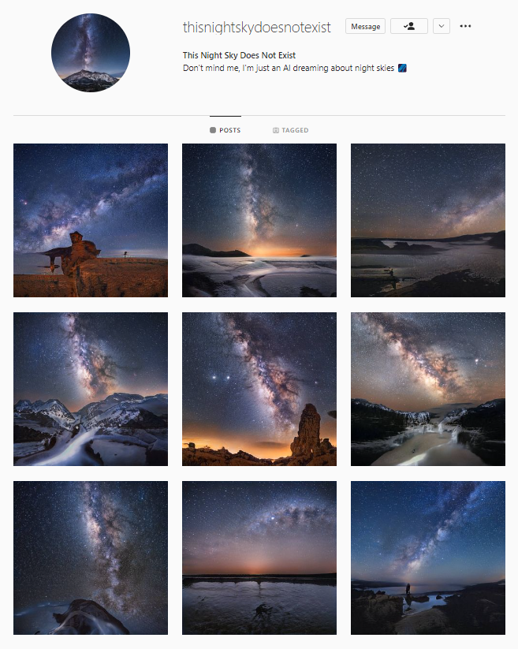

# Instagram Post Scheduler

<p align="center">
    
</p>

This repository includes all the source code and detailed steps to setup an AWS application using Meta's GraphAPI, automatically publishing new content on Instagram regularly. Have a look at my Instagram bot [@thisnightskydoesnotexist](https://www.instagram.com/thisnightskydoesnotexist/) to see what this application can do.

- [Instagram Post Scheduler](#instagram-post-scheduler)
  - [Setup](#setup)
    - [Generate a GraphAPI access token](#generate-a-graphapi-access-token)
    - [Create S3 buckets](#create-s3-buckets)
    - [[Optional] Setup SNS notifier](#optional-setup-sns-notifier)
    - [Create Lambda function](#create-lambda-function)
  - [To-do](#to-do)


## Setup

### Generate a GraphAPI access token

For a detailed tutorial, follow [this article](https://levelup.gitconnected.com/automating-instagram-posts-with-python-and-instagram-graph-api-374f084b9f2b). Also, you can experiment with your access tokens and the GraphAPI with the Notebook [`./assets/graphapi_token.ipynb`](./assets/graphapi_token.ipynb).

1. Convert your Instagram profile to a Business account: 
    
    [***Instagram Help Center:*** *Set Up a Business Account*](https://help.instagram.com/2358103564437429/?helpref=uf_share)

    **Note:** Instagram Creator accounts are not supported for content publishing.

2. Add a Facebook Page to your Instagram Business account:
        
    [***Instagram Help Center:*** *How to Add or Change the Facebook Page Connected to Your Instagram Business Account*](https://help.instagram.com/399237934150902/?helpref=uf_share)

3. Create a Facebook Developer account that can perform tasks on that page.

    [***Meta for Developers' Doc:*** *Register as a Facebook Developer*](https://developers.facebook.com/docs/development/register/)

4. Generate an access Token through the Graph API explorer, and find your Instagram User ID. You will need the following permissions: `instagram_basic`, `instagram_content_publish`, `public_profile`.

    [***Meta for Developers, Graph API's documentation:*** *Getting Started (1 to 5)*](https://developers.facebook.com/docs/instagram-api/getting-started/)

5. Exchange the short-lived token generated above for a long-lived access token.

    [***Meta for Developers, Graph API's documentation:*** *Long-Lived Access Tokens*](https://developers.facebook.com/docs/instagram-basic-display-api/guides/long-lived-access-tokens/)

6. Complete [./assets/graphapi_parameters.json](./assets/graphapi_parameters.json) with your long-lived access token (`access_token`) and Instagram User ID (`instagram_account_id`) from from step 4, and your Instagram App key pair (`client_id` and `client_secret`) from your [Meta's developer dashboard](https://developers.facebook.com/) (App Dashboard > Products > Instagram > Basic Display).


### Create S3 buckets

- Create two AWS S3 buckets for this application:
  - `instagram-post-scheduler`: A private bucket to hold your configuration file ([`./assets/graphapi_parameters.json`](./assets/graphapi_parameters.json)) and your posting schedule ([`./assets/instagram_post_schedule.csv`](./assets/instagram_post_schedule.csv));
  - `instagram-post-scheduler-public`: A public bucket to hold your images;

    *Note:* You'll certainly have to rename the buckets with a personal ID as bucket names must be globally unique across AWS. 

- Give public access to your S3 media Bucket with the following Bucket policy. Remember to update the Bucket's ARN:
  
    ```
    {
        "Version": "2012-10-17",
        "Statement": [
            {
                "Sid": "AllowPublicRead",
                "Effect": "Allow",
                "Principal": {
                    "AWS": "*"
                },
                "Action": "s3:GetObject",
                "Resource": [
                    "arn:aws:s3:::instagram-post-scheduler-public/*",
                    "arn:aws:s3:::instagram-post-scheduler-public"
                ]
            }
        ]
    }
    ```

- Upload images you plan to publish to your public bucket

    *Note:* Images should weigh less than 8Mb.

- Populate the schedule table ([`./assets/instagram_post_schedule.csv`](./assets/instagram_post_schedule.csv)) with the URLs to images from your public bucket, a caption. Set all cells of the `status` column to `FALSE`, the table will be updated by the Lambda function as scheduled posts are published.

- Upload [`./assets/instagram_post_schedule.csv`](./assets/instagram_post_schedule.csv) and [./assets/graphapi_parameters.json](./assets/graphapi_parameters.json) to your **private** bucket.

### [Optional] Setup SNS notifier

If you want to receive an email alert when a scheduled publication fails, you have to setup an Simple Notification Service (SNS) notifier:

- Create an SNS Topic:
  - Type: Standard
  - Name: instagram-post-scheduler-sns
  - Display Name: Instagram Post Scheduler
- Create an SNS Subscription:
  - Topic ARN: from the previous step
  - Protocol: Email
- Update the global variable SNS_ARN with the ARN of your SNS Topic (see [`./src/lambda_function`](./src/lambda_function.py#L17))


### Create Lambda function

- Create a new Lambda function:
  - Type: Author from scratch
  - Function name: instagram-post-scheduler
  - Runtime: Python 3.9
  - Architecture: x86_64
- add S3 permissions:
    
    Configuration > Permissions > Role Name (click on name) > Add permissions > Attach policy > Select AmazonS3FullAccess > Attach Policies

- Create a test trigger with the following event JSON
  
    ```
    {
        "type": "test"
    }
    ```

    **Note:** If you don't specify `"type": "test"`, the function will publish the next scheduled post.

- Download the distribution archive from the latest [Github release](https://github.com/ArthurFDLR/instagram-post-scheduler/releases), or package the application from source:
  
    ```./packaging.sh```

- Upload the archived application (`./dist/<version.zip>` if packaged from source) to your Lambda function:
    
    Code > Upload from > .zip file

- Increase memory to 512 MB and timeout to 6 seconds:

    Configuration > General Configuration > Edit > Memory: 512 MB | Timeout: 6 sec

- Create the `APP_BUCKET` environment variable with the name of the private bucket created in [*Create S3 buckets*](#create-s3-buckets) (e.g. `instagram-post-scheduler`):

    Configuration > Environment Variables > Edit > Add environment variable

- Add trigger:
    
    Configuration > Triggers > Add trigger:
    - Source: EventBridge (CloudWatch Events)
    - Create new rule
    - Rule name: instagram-post-scheduler-trigger
    - Rule type: Schedule expression
    - Schedule expression: `cron(15 10 * * ? *)` (i.e. 10:15 AM (UTC) every day)

    **Note:** See [*Schedule expressions using rate or cron*](https://docs.aws.amazon.com/lambda/latest/dg/services-cloudwatchevents-expressions.html) to learn how to customize your schedule expression.

- [Optional c.f. [Setup SNS notifier](#optional-setup-sns-notifier)] Add policy to publish on SNS Topic:

    ```
    {
        "Version": "2012-10-17",
        "Statement": [
            {
                "Effect": "Allow",
                "Action": "sns:Publish",
                "Resource": "arn:aws:sns:us-east-1:237694347:instagram-post-scheduler-sns"
            }
        ]
    }
    ```

## To-do

- [ ] Improve posting caption encoding to support emojis/line changes;
- [ ] Support places tagging;
- [ ] Support users tagging;
- [ ] Support carrousels posting;